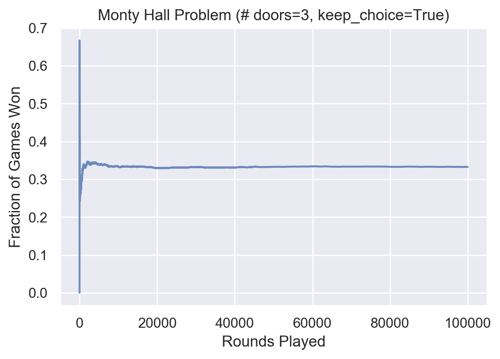

# Simulations
Playground for simulating fun brain teasers.

### Market Reach

How can we better understand how incremental reach changes over time? 
 

### Monty Hall Problem

Goat or car? Which do you want more?
 

